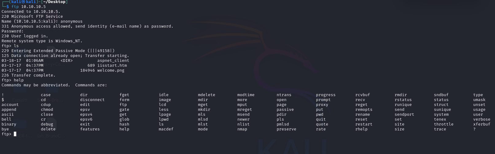
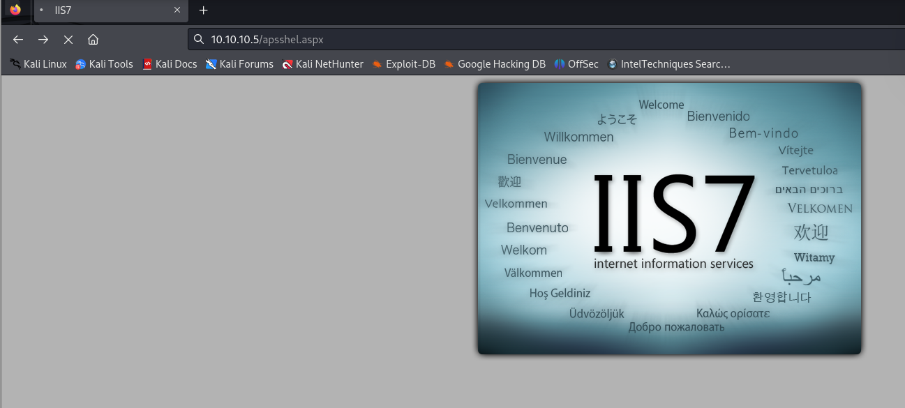

# DEVELHTB

Machine Devel Hack The Box 

## RECON

**Nmap**

**We find 2  ports open** 

PORT   STATE SERVICE REASON  VERSION
21/tcp open  ftp     syn-ack Microsoft ftpd
| ftp-syst: 
|_  SYST: Windows_NT
| ftp-anon: Anonymous FTP login allowed (FTP code 230)
| 03-18-17  01:06AM       <DIR>          aspnet_client
| 03-17-17  04:37PM                  689 iisstart.htm
|_03-17-17  04:37PM               184946 welcome.png
80/tcp open  http    syn-ack Microsoft IIS httpd 7.5
|_http-server-header: Microsoft-IIS/7.5
|_http-title: IIS7
| http-methods: 
|   Supported Methods: OPTIONS TRACE GET HEAD POST
|_  Potentially risky methods: TRACE
Service Info: OS: Windows; CPE: cpe:/o:microsoft:windows

**We can get into teh ftp using Anonymous user.**

**We visit the IIS service runing on port 80**

  **if i upload a file  in  the ftp i can see the file into the website**

## EXPLOIT

**So i search for a reverse shell build on aspx**

https://github.com/borjmz/aspx-reverse-shell/blob/master/shell.aspx

**I upload tyo ftp server and start lisen using mtasploit multi/handler in my attack host**

Using Metasploit **multi/recon/local_exploit_suggester**

 

